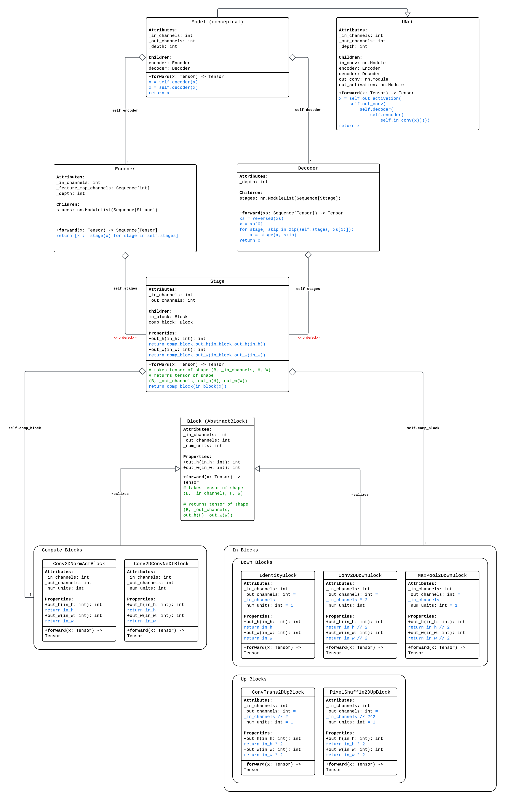

# `virtual_stain_flow.models`

## Overview

The model module defines a modular and extensible framework for building 
image-to-image translation models. For now most of its functionality is built
around enabling a "declarative" style creation of U-Net-like architectures, with
a hierarchy of abstractions, including blocks, stages, encoders, decoders.

## Key Components/building blocks of the Framework

> Figure 1. The UML diagram describes the aggregation of the 3 levels of 
abstraction into image-image translation models, with details provided for key 
function implementations. 

### Blocks
Blocks are the smallest modular units in the model, responsible for directly
processing feature map tensors. They can be categorized into:

1. **Computational Blocks**: Preserve spatial dimensions while potentially 
altering the number of channels. Inherits directly from `AbstractBlock`.

    Implementations include:
    - `Conv2DNormActBlock`: A computational block that applies a 2D convolution 
    followed by normalization and activation. 
    This block is commonly used for feature extraction and transformation 
    while preserving spatial dimensions.   
    - `Conv2DConvNeXtBlock`: A computational block inspired by the ConvNeXt 
    architecture. It applies a series of convolutions, normalization, and 
    activation functions designed to enhance feature extraction and 
    representation. This block is particularly useful for capturing complex 
    patterns in image data while maintaining spatial dimensions.

2. **Spatial Dimension Altering Blocks**: Change spatial dimensions, such as 
downsampling or upsampling. Inherits from `AbstractUpBlock` or `AbstractDownBlock`.

    Implementations include:
    - `IdentityBlock`: No-op block for first layer of UNets.
    - `Conv2DDownBlock`: Down-samples image by a factor of 2. Followed by a 
        optional Normalization layer.
    - `MaxPool2DDownBlock`: Down-samples image by a factor of 2.
    - `ConvTrans2DUpBlock`: Up-samples image by a factor of 2. Followed by
        a optional Normalization layer.
    - `PixelShuffle2DUpBlock`: Up-samples image by a factor of 2. 

### Stages
Stages are packaged sequences of blocks that perform a specific operation, 
such as downsampling or upsampling followed by compute. 

A `Stage` class accepts a `in_block` handle and a `comp_block` handle, 
and dynamically creates a sequence of blocks with compatible input/output
sizes. Although the `Stage` class does not enforce a specific checks for this,
it is recommended to initialize a `Stage` class with a 
**Spatial Dimension Altering** `in_block` and a **Computational** `comp_block`.

The module provides additional Stage classes, that still can be flexibly 
initialized with custom combination of `in_block` and `comp_block`, and with 
predefined behavior:
- `DownStage`: Handles downsampling operations from a input feature map tensor.
- `UpStage`: Handles upsampling operations with skip connections support,
processes the input feature map through a upsampling `in_block`, performs
concatenation with skip connections if applicable, and finally compute with
`comp_block`. 

### Encoder
The `Encoder` class implements the downsampling path of a U-Net-like 
architecture. It consists of multiple `DownStage` objects, each reducing the 
spatial dimensions of the input tensor while capturing hierarchical features.

### Decoder
The `Decoder` class implements the upsampling path of a U-Net-like architecture. 
It consists of multiple `UpStage` objects, each increasing the spatial 
dimensions of the input tensor while incorporating skip connections from the 
encoder.

### U-Net
The `UNet` class is a pre-defined model class , supports two architectural variants:
1. Fully convolutional U-Net with `Conv2DDownBlock` and `ConvTrans2DUpBlock`.
2. More coventional U-Net with `MaxPool2DDownBlock` and `ConvTrans2DUpBlock`.

## Utilities/Handle type checking
Includes utility functions for retrieving normalization layers (`get_norm`), 
activation functions (`get_activation`), and type checking of block handles
and configurations, centralizing shared operations.

## Example Usage
Refer to the `EXAMPLES/MODULAR_UNET_EXAMPLE.IPYNB` notebook for detailed 
examples of block/stage behavior, model definition. 

## File Structure
- `blocks.py`: Defines computational and spatial dimension altering blocks.
- `up_down_blocks.py`: Implements downsampling and upsampling blocks.
- `stages.py`: Defines stage objects for downsampling and upsampling.
- `encoder.py`: Implements the encoder path.
- `decoder.py`: Implements the decoder path.
- `unet.py`: Wraps the encoder and decoder into a complete U-Net model.
- `utils.py`: Provides utility functions for normalization and activation layers.
- `handle_type_checking.py`: Centralizes type checking and validation for 
block configurations.